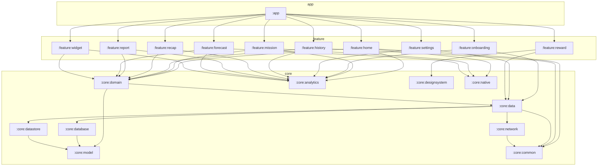
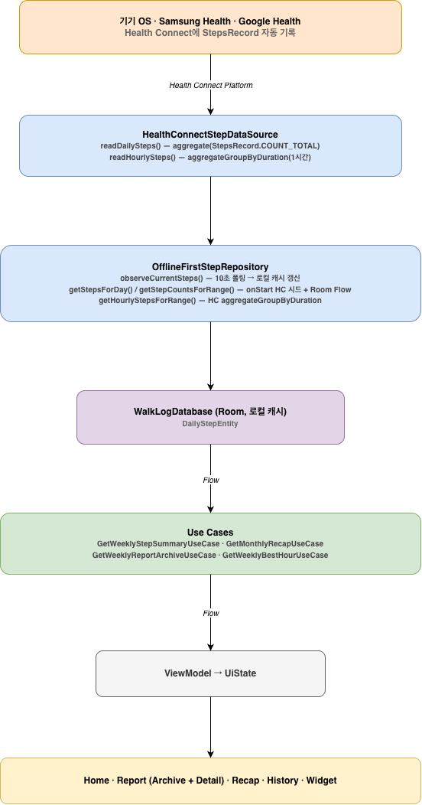
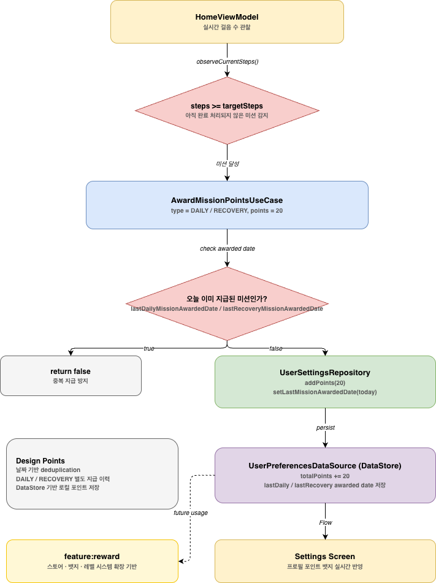

# WalkLog

> Health Connect + Weather-aware Android walking companion built with Kotlin, Jetpack Compose, Clean Architecture, and production-grade engineering practices.

[](https://kotlinlang.org)
[](https://developer.android.com/build)
[](https://developer.android.com/jetpack/compose/bom)
[](https://developer.android.com)
[](https://developer.android.com)
[](https://developer.android.com)
[](https://firebase.google.com)

---

WalkLog는 **Google Health Connect**를 통해 오늘의 걸음 수를 읽고, 미션·주간 리포트·월간 리캡·홈 화면 위젯으로 사용자의 걷기 흐름을 보여주는 서비스 입니다.

---

## Deep Dive Docs

기술 결정과 동작 원리는 아래 문서에서 다룹니다.

| 문서                                                                 | 내용                                                                                    |
|--------------------------------------------------------------------|---------------------------------------------------------------------------------------|
| [Baseline Profile](docs/baseline-profile.md)                       | ART JIT vs AOT, 프로파일 생성 원리, 콜드 스타트 개선 효과, 적용 방법                                       |
| [R8 난독화](docs/r8-obfuscation.md)                                | Shrinking·Obfuscation·Optimization 3단계, APK 크기 감소, ProGuard 규칙                        |
| [보안 설계](docs/security.md)                                      | Network Security Config, MitM 방어, 백업 데이터 보호, OWASP 매핑                                 |
| [아키텍처 결정 기록](docs/architecture-decisions.md)                   | Modularization, Architecture, UDF, Convention Plugin, XML+Compose 등 각 결정의 이유와 트레이드오프 |
| [NDK/JNI 엔진](docs/ndk-jni-engine.md)                            | C++ Walking Insights Engine 설계, JNI 데이터 흐름, CMake 설정, 알고리즘                            |
| [LiteRT Activity Classifier](docs/litert-activity-classifier.md) | 온디바이스 HAR 모델, 센서 수집 파이프라인, 텐서 레이아웃, 배터리 최적화                                           |
| [유저 플로우 & 데이터 흐름](docs/user-flow.md)                            | Health Connect 수집부터 각 화면 표시까지 전체 데이터 흐름                                               |

---

## Contents

- [Features](#features)
- [Architecture](#architecture)
- [Module Graph](#module-graph)
- [Dependency Injection](#dependency-injection)
- [Step Data Pipeline](#step-data-pipeline)
- [Points & Reward System](#points--reward-system)
- [Crash Reporting](#crash-reporting)
- [Performance](#performance)
- [Security](#security)
- [Testing](#testing)
- [Tech Stack](#tech-stack)
- [Convention Plugins](#convention-plugins)
- [Getting Started](#getting-started)
- [Current Scope](#current-scope)

---

## Features

### Onboarding
- 4단계 `HorizontalPager` (닉네임 입력 → HC 권한 → 목표 설정 → 알림 권한)
- 완료 시 DataStore에 닉네임·목표·설정 저장

### Home
- Health Connect 실시간 걸음 수 · 달성률 표시, 권한·가용성 상태별 UI 분기
- 닉네임, `WalkProgressRing` pulse 애니메이션 (`WALKING` 감지 시), 스트릭 뱃지
- KMA 초단기예보 날씨 카드 (기온·상태·걷기), 지난주 리포트 요약 카드
- 피크타임 기반 `AlarmManager` 알림 (`WalkingInsightsEngine` → `AlarmManagerWalkingReminderScheduler`)

### Mission
- 오늘 미션 / 회복 미션 배지, 진행률 카드, 피크타임 기반 추천 시간대 안내
- 미션 달성 시 포인트 지급

### Weekly Report
- 최근 12주 목록 + 상세 리포트(막대 그래프 + 이미지 공유)
- `GraphicsLayer` → `Bitmap` → `FileProvider` URI 방식으로 공유 카드 내보내기

### Monthly Recap
- 8장 스토리형 슬라이드 (총 걸음 수 → 평균 → 칼로리 → 달성일 → 베스트 데이 → 스트릭 → 페르소나)
- 자동 진행 타이머, 일시정지/재생

### Step History
- 캘린더 뷰 (월별 스크롤, HC 데이터 기반 일별 걸음 수 표시)
- 날짜 탭 시 해당 날짜의 칼로리 소모량, 거리 등 상세 정보 제공

### Settings
- 프로필 섹션 (닉네임 이니셜 아바타 + 포인트 뱃지)
- 목표·회복 걸음 수 SeekBar 조정, 알림 토글, 라이트/다크/시스템 테마 즉시 적용

### Reward(티져 버전)
- 잠금 상태 미리보기 카드
- 포인트 사용처(스토어·뱃지·레벨)는 추후 업데이트 예정

### App Widget
- Jetpack Glance 기반, WorkManager 15분 자동 업데이트
- 포그라운드 동기화 + 위젯 새로고침 버튼 액션

---

## Architecture

본 프로젝트는 **Now in Android(NiA)** 의 구조를 참고했습니다.

### 계층 원칙

```
Presentation (feature:*)
    ↓  use cases
core:domain (Use cases only)
    ↓
core:data
    ↓
core:database / core:datastore
    ↓
core:model
```

| 계층 | 역할                              | NiA 대응 |
|---|---------------------------------|---|
| `core:model` | data class | `core:model` |
| `core:data` | Repository | `core:data` |
| `core:domain` | Use cases | `core:domain` |
| `core:datastore` | DataSource | `core:datastore` |
| `core:database` | Room DB · DAO · Entity | `core:database` |

- **`core:model`** 은 순수 Kotlin 데이터 클래스만 포함. Android 의존성 없음.
- **`core:database`** · **`core:datastore`** 는 `api(core:model)`로 모델 타입을 위로 노출.
- **`core:domain`** 은 `api(core:data)` + `api(core:model)` 양쪽을 명시적으로 선언합니다.
- **ViewModel**은 `StateFlow<UiState>` 하나만 노출하고, UI는 단방향(`Intent → ViewModel → State → UI`)으로 흐릅니다.

## Module Graph



전체 의존성 그래프 시각화:

```bash
./gradlew projectDependencyGraph
```

---

## Dependency Injection

Hilt를 전 계층에 일관되게 적용합니다.

| 위치 | 방식                                                      |
|---|---------------------------------------------------------|
| `@HiltAndroidApp` | `WalkLogApplication` — DI 그래프 루트                        |
| `@AndroidEntryPoint` | 모든 Fragment                                             |
| `@HiltViewModel` | 모든 ViewModel                                            |
| `@Singleton` | `StepRepositoryImpl`, `HealthConnectStepDataSource`.... |
| `@InstallIn(SingletonComponent)` | `DatabaseModule`, `DataModule`, `AnalyticsModule`...    |
| Hilt WorkManager | `TodayMissionWidgetWorker`          |

```kotlin
// 인터페이스 바인딩 예시 (core:analytics)
@Module
@InstallIn(SingletonComponent::class)
abstract class AnalyticsModule {
    @Binds
    abstract fun bindCrashReporter(impl: CrashlyticsReporter): CrashReporter
}
```

---

## Step Data Pipeline

WalkLog는 **Google Health Connect**를 데이터 소스로 사용합니다.




**설계 결정 포인트:**

| 결정 | 이유                                            |
|---|-----------------------------------------------|
| Health Connect READ-ONLY | HC 플랫폼이 deduplication · 노이즈 필터링 · 다중 앱 집계를 처리 |
| 10초 폴링(`observeCurrentSteps`) | HC는 실시간 스트림 API 미제공                           |
| `onStart` HC 시드 + Room Flow | HC에서 최신값을 DB에 쓴 뒤 Room Flow로 반응형 업데이트         |
| `DailyStepEntity` 로컬 캐시 유지 | HC 오프라인 · 권한 미부여 시에도 마지막 값 표시 가능              |
| `fallbackToDestructiveMigration()` | HC 마이그레이션(v2)                                 |
| 누락 날짜 → `DailyStepCount(steps = 0)` | 주간/월간/달력 UI가 완전한 날짜 범위를 렌더링 가능                |

---

## Points & Reward System

WalkLog는 **미션 달성 시 포인트를 적립**하고, 날짜 기반 지급 이력으로 중복 지급을 방지합니다.



---

## Crash Reporting

Firebase Crashlytics를 feature 모듈이 직접 의존하지 않도록 `core:analytics` 추상화 계층을 도입했습니다.

```
feature:* → CrashReporter (interface, core:analytics)
                  ↑
         CrashlyticsReporter (impl, bound in app via Hilt)
```

```kotlin
interface CrashReporter {
    fun recordException(throwable: Throwable)
    fun log(message: String)
    fun setKey(key: String, value: String)
}
```

**`CrashKeys` 중앙화:**

```kotlin
object CrashKeys {
    const val SCREEN = "screen"
    const val SENSOR_STATUS = "sensor_status"
    const val CURRENT_STEPS = "current_steps"
    const val TARGET_STEPS = "target_steps"
    const val WIDGET_INSTANCE_COUNT = "widget_instance_count"
    const val WORKER_RUN_ATTEMPT = "worker_run_attempt"

    object Screens {
        const val HOME = "home"
        const val WEEKLY_REPORT = "weekly_report"
        const val MISSION_DETAIL = "mission_detail"
        const val RECAP = "recap"
        const val FORECAST = "forecast"
        const val ONBOARDING = "onboarding"
        const val SETTINGS = "settings"
        const val HISTORY = "history"
    }
}
```

---

---

## Performance

### Baseline Profile

`:benchmark` 모듈에 `BaselineProfileGenerator`를 작성해 앱 시작 경로와 주요 사용자 흐름을 ART에 미리 학습시킵니다.

```bash
./gradlew :benchmark:connectedBenchmarkAndroidTest
```

**커버하는 사용자 흐름:**
- 콜드 스타트 → 홈 화면 진입
- 홈 화면 스크롤
- 주간 리포트 진입 → 뒤로가기
- 미션 상세 진입 → 뒤로가기

### R8 Full Mode

`release` 빌드에서 R8 전체 최적화를 활성화합니다.

```kotlin
getByName("release") {
    isMinifyEnabled = true
    isShrinkResources = true
}
```

---

## Security

### Network Security Config

```xml
<network-security-config>
    <base-config cleartextTrafficPermitted="false">
        <trust-anchors>
            <certificates src="system" />
        </trust-anchors>
    </base-config>
    <debug-overrides>
        <trust-anchors>
            <certificates src="system" />
            <certificates src="user" />
        </trust-anchors>
    </debug-overrides>
</network-security-config>
```

### Backup / Data Protection

```xml
<cloud-backup>
    <exclude domain="database" path="." />
    <exclude domain="file" path="datastore" />
</cloud-backup>
```

Room DB(걸음 수 이력)와 DataStore(닉네임·포인트·설정)는 클라우드 백업·기기 이전에서 제외합니다.

---

## Testing

### 테스트 전략

| 위치 | 러너 | 대상 |
|---|---|---|
| `src/test/` | Robolectric JVM | 컴포넌트 단위 (ViewModel, UseCase, Repository, 단일 Composable) |
| `src/androidTest/` | 실기기/에뮬레이터 | 화면 전체 (Route 단위 Compose UI 테스트) |

```bash
./gradlew test
./gradlew :core:domain:test
./gradlew :core:data:test
./gradlew :feature:home:test
./gradlew connectedAndroidTest
```

### 테스트 커버리지

**Model 계층** — `MissionTest` (progressRatio 경계값)

**Common 계층** — `ResultTest` (onSuccess / onError 체이닝)

**Domain / Data 계층**
- `WeeklyStepSummaryTest` · `MonthlyRecapTest` — 도메인 모델 불변식
- `GetWeeklyStepSummaryUseCaseTest` · `GetWeeklyReportArchiveUseCaseTest` · `GetWeeklyBestHourUseCaseTest` — 집계·아카이브·베스트아워 로직
- `StepRepositoryImplTest` — HC 위임, Flow 매핑, 누락 날짜 zero-fill

**Feature ViewModel 계층**
- `HistoryViewModelTest` — 달력 아이템 구조, 월 이동, 통계 포맷
- `OnboardingViewModelTest` — 4단계 페이지 전환 상태 머신, 완료 시 repository 호출
- `SettingsViewModelTest` — 닉네임 관찰, 포인트 관찰, 각 Intent → repository 매핑

**Compose UI 테스트 (androidTest)**
- `HomeScreenTest` — 센서 상태별 UI (로딩/권한 없음/사용 불가/정상)
- `WeeklyReportScreenTest` — 아카이브·상세 렌더링, 공유 버튼 상태
- `MissionDetailScreenTest` — 달성 전/후 상태, 뒤로가기 콜백
- `RecapScreenTest` — 슬라이드 전환, 일시정지/재생
- `ForecastDetailBottomSheetTest` — BottomSheet 표시/닫기

### 주요 도구

- **MockK**: 코루틴 친화적인 Kotlin mock 라이브러리
- **Turbine**: `Flow` 테스트 전용 라이브러리
- **Robolectric**: JVM 위에서 Android 환경 에뮬레이션
- **`createAndroidComposeRule<ComponentActivity>()`**: NiA 기기 테스트 표준

---

## Tech Stack

| 영역 | 기술                                                                                 |
|---|------------------------------------------------------------------------------------|
| Language | Kotlin 2.1.0, C++17                                                                |
| UI | Jetpack Compose, Material 3, XML Layouts + ViewBinding, XML Navigation host        |
| Animation | Lottie                                                                             |
| Architecture | MVVM, Google Recommended Architecture                      |
| DI | Hilt 2.55, Hilt WorkManager                                                        |
| Async | Kotlin Coroutines, Flow                                                            |
| Persistence | Room 2.7.1, DataStore Preferences                                                  |
| Network | OkHttp (KMA 초단기예보 API), in-memory weather cache                                    |
| On-device AI | LiteRT 1.0.1 (Activity Classifier), NDK/JNI (Walking Insights Engine)              |
| Widget | Jetpack Glance 1.1.1, WorkManager                                                  |
| Analytics | Firebase Crashlytics, Firebase Analytics                                           |
| Performance | Baseline Profile, R8 Full Mode                       |
| Security | Network Security Config, ProGuard/R8 obfuscation, Backup protection                |
| Image | Coil 3                                                                             |
| Build | Gradle Kotlin DSL, Version Catalog, Convention Plugins, CMake 3.22.1 |
| Testing | JUnit4, MockK, Turbine, Robolectric, Compose UI Test, Espresso                     |


---

## Convention Plugins

| Plugin ID | 적용 대상 | 포함 내용 |
|---|---|---|
| `river.android.application` | `:app` | compileSdk 36, minSdk 28, Kotlin Android, Hilt |
| `river.android.library` | `core:*` 대부분 | compileSdk 36, minSdk 28, Kotlin Android, Hilt 자동 포함 |
| `river.android.feature` | `feature:*` | library 기반 + Hilt + Compose + HiltNavigation |
| `river.android.compose` | Compose 사용 모듈 | Compose BOM, tooling, compiler plugin |
| `river.android.test` | 단위 테스트 모듈 | JUnit4, MockK, Turbine, Coroutines Test |
| `river.android.uitest` | Compose UI 테스트 | Robolectric, Compose UI Test, Mock |
| `river.kotlin.library` | `core:domain` 등 순수 Kotlin | JVM 타겟, Kotlin only |
| `river.kotlin.test` | 순수 Kotlin 테스트 | JUnit, Kotlin Test, Coroutines Test |

신규 feature 모듈 추가 시 `id("river.android.feature")` 한 줄만 선언하면 Hilt·Compose·테스트 설정이 모두 자동 적용됩니다.

---

## Getting Started

### Requirements

- Android Studio Hedgehog 이상 (JDK 21 포함)
- Android SDK 35
- Firebase 프로젝트 + `google-services.json`

### Build

```bash
./gradlew build
./gradlew installDebug
./gradlew assembleRelease
```

### Module Specific

```bash
./gradlew :core:domain:test
./gradlew :core:data:test
./gradlew :feature:home:connectedAndroidTest
./gradlew :benchmark:connectedBenchmarkAndroidTest
./gradlew projectDependencyGraph
```

### Permissions

| 권한 | 필요 버전 | 용도 |
|---|---|---|
| `android.permission.health.READ_STEPS` | Health Connect 설치 기기 | 걸음 수 읽기 |
| `PERMISSION_READ_HEALTH_DATA_IN_BACKGROUND` | Health Connect | 백그라운드 위젯 업데이트 |
| `INTERNET` | 모든 버전 | KMA 날씨 API |
| `POST_NOTIFICATIONS` | API 33+ | 피크아워 알림 |
| `RECEIVE_BOOT_COMPLETED` | 모든 버전 | 재부팅 후 AlarmManager 재등록 |

**HC Android 14+ 매니페스트 요구사항**: HC 권한 다이얼로그를 정상적으로 표시하려면 `AndroidManifest.xml`에 두 가지 `activity-alias`를 모두 선언해야 합니다.

```xml
<activity-alias android:name=".HealthConnectPrivacyRationaleActivity" ...>
    <intent-filter>
        <action android:name="androidx.health.ACTION_SHOW_PERMISSIONS_RATIONALE" />
    </intent-filter>
</activity-alias>

<activity-alias android:name=".HealthConnectPermissionUsageActivity"
    android:permission="android.permission.START_VIEW_PERMISSION_USAGE" ...>
    <intent-filter>
        <action android:name="android.intent.action.VIEW_PERMISSION_USAGE" />
        <category android:name="android.intent.category.HEALTH_PERMISSIONS" />
    </intent-filter>
</activity-alias>
```

---

## Current Scope

| 영역                                 | 현재 상태                                                    |
|------------------------------------|----------------------------------------------------------|
| 걸음 수 파이프라인                         | 완성 (Health Connect → Room → Domain → UI)                 |
| 날씨 파이프라인                           | 완성 (KMA → DefaultWeatherRepository → WeatherSummaryCard) |
| 홈 화면                               | 완성 (닉네임 표시, 미션 달성 포인트 지급 포함)                             |
| 주간 리포트                             | 완성 (Archive + Detail 2화면, 막대 그래프, 이미지 공유)                |
| 월간 리캡                              | 완성                                                       |
| 앱 위젯                               | 완성 (WorkManager + 포그라운드 동기화 + 새로고침 액션)                   |
| Baseline Profile                   | 완성                                                       |
| R8 + 보안 설정                         | 완성                                                       |
| Crashlytics 전면 적용                  | 완성                                                       |
| SplashScreen                       | 완성                                                       |
| 온보딩                                | 완성 (4단계 HorizontalPager + 닉네임 입력)                        |
| 걸음 기록 달력                           | 완성 (날짜 탭 상세 패널)                                          |
| 설정 화면                              | 완성 (프로필 섹션, 닉네임 수정, 포인트 표시)                              |
| DataStore                          | 완성 (닉네임·포인트·목표·알림·테마·온보딩 완료)                             |
| 포인트 적립 시스템                         | 완성 (미션 달성 시 지급, 날짜 중복 방지, 설정 화면 실시간 표시)                  |
| 리워드 화면                             | 완성 (티져 화면 — 포인트 사용처는 추후 업데이트 예정)                         |
| 피크타임 알림                            | 완성 (AlarmManager 기반, peakHour 연동)                        |
| 미션 데이터 연결                          | 완성 (WalkingInsightsEngine + 실시간 걸음 수 + 포인트 지급)           |
| on-device AI (Walking Insights)    | 완성 (C++ JNI 엔진)                                          |
| on-device AI (Activity Classifier) | 완성 (LiteRT HAR 모델 — 모델 파일 별도 배치 필요)                      |
| 닉네임                                | 완성 (온보딩 입력 → DataStore → 홈 인사 + 설정 수정)                   |

다음 단계 확장 포인트:
- 리워드 스토어 / 뱃지 컬렉션 / 레벨 시스템 (`feature:reward`)
- `activity_classifier.tflite` 모델 파일 배치 후 실기기 HAR 분류 검증
