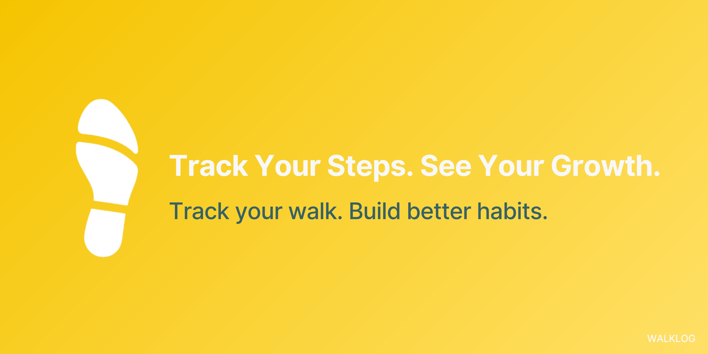
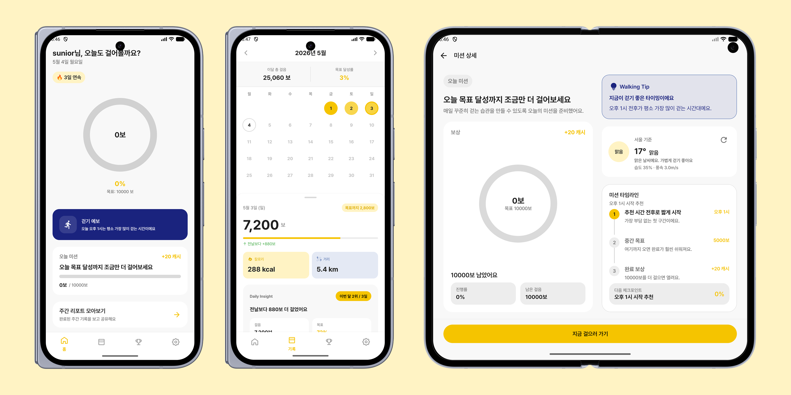
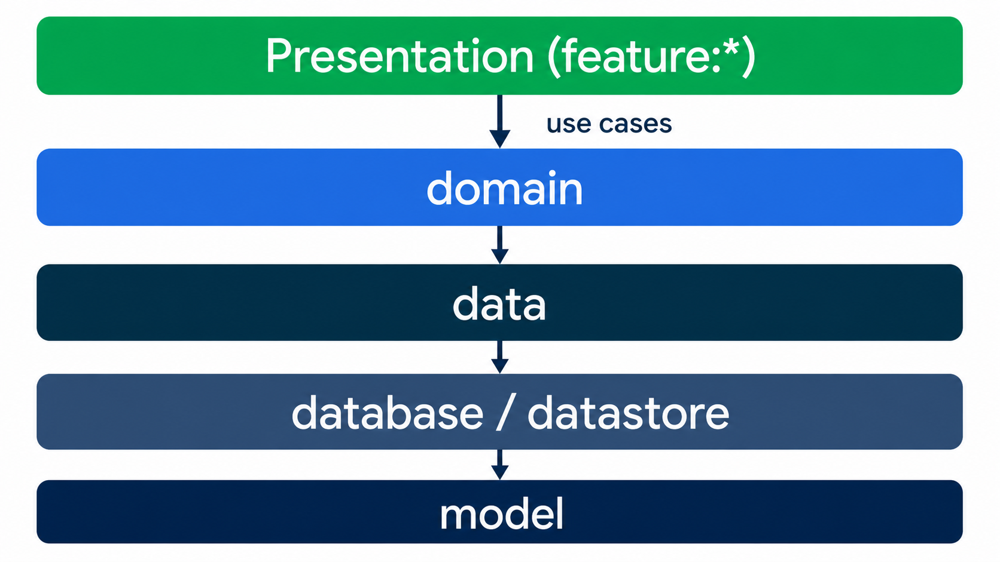
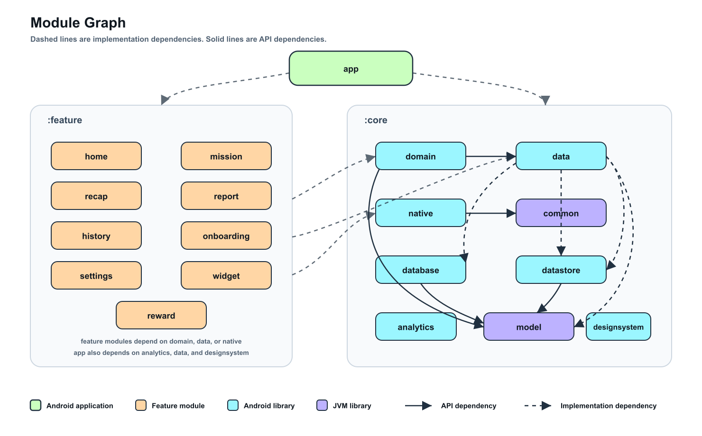
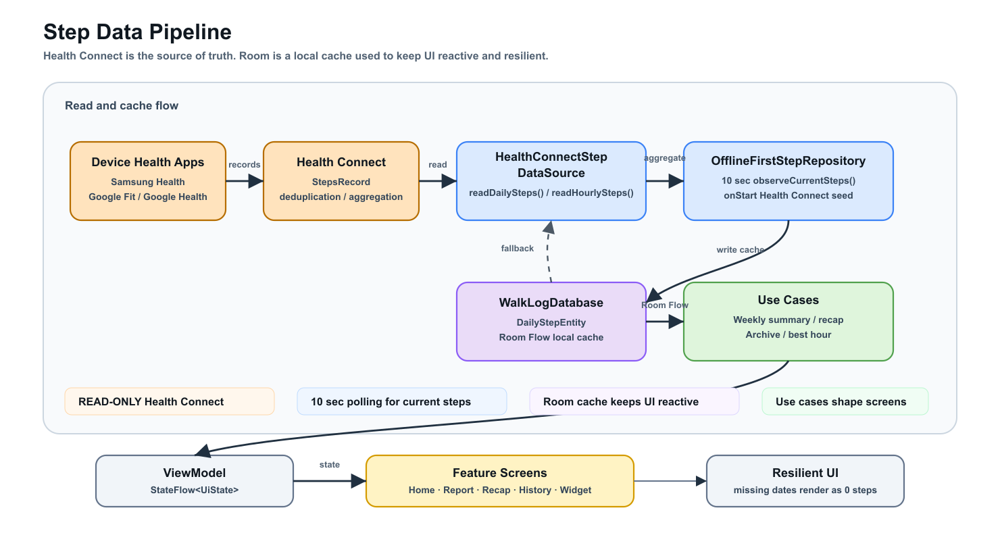
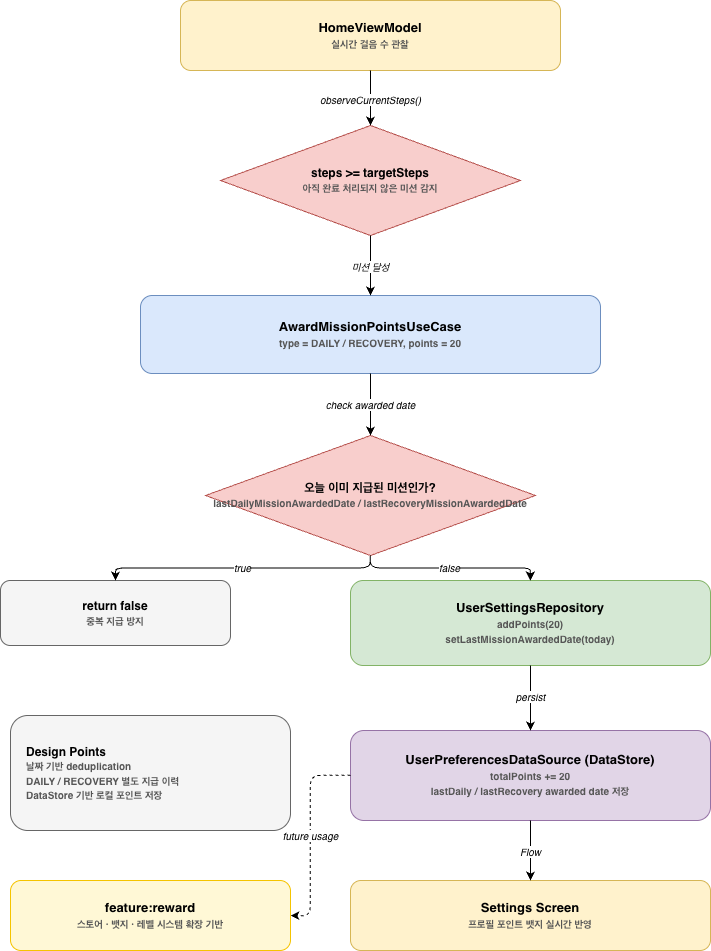

> A Health Connect-powered Android walking companion that turns daily steps into missions, reports, recaps, and widgets.

English | [한국어](README.ko.md)

[](https://kotlinlang.org)
[](https://developer.android.com/build)
[](https://developer.android.com/jetpack/compose/bom)
[](https://developer.android.com)
[](https://developer.android.com)
[](https://developer.android.com)
[](https://firebase.google.com)

WalkLog App
==================

WalkLog reads today's step count through **Google Health Connect** and turns walking activity into missions, weekly reports, monthly recaps, home insights, and app widgets.

---

# Deep Dive Docs

Deep Dive Docs are currently maintained in **Korean**. English versions will be added later.

| Document | Topic |
|---|---|
| [Baseline Profile](docs/baseline-profile.md) | ART JIT vs AOT, profile generation, cold-start improvements, and setup |
| [R8 Obfuscation](docs/r8-obfuscation.md) | Shrinking, obfuscation, optimization, APK size reduction, and ProGuard rules |
| [Security Design](docs/security.md) | Network Security Config, MitM defense, backup protection, and OWASP mapping |
| [Architecture Decision Records](docs/architecture-decisions.md) | Reasons and tradeoffs behind modularization, architecture, UDF, convention plugins, XML+Compose, and more |
| [NDK/JNI Engine](docs/ndk-jni-engine.md) | C++ Walking Insights Engine design, JNI data flow, CMake setup, and algorithms |
| [LiteRT Activity Classifier](docs/litert-activity-classifier.md) | On-device HAR model, sensor collection pipeline, tensor layout, and battery optimization |
| [User Flow & Data Flow](docs/user-flow.md) | End-to-end data flow from Health Connect collection to each screen |

---

# Contents

- [Features](#features)
- [Architecture](#architecture)
- [Module Graph](#module-graph)
- [Dependency Injection](#dependency-injection)
- [Step Data Pipeline](#step-data-pipeline)
- [Points & Reward System](#points--reward-system)
- [Crash Reporting](#crash-reporting)
- [Performance](#performance)
- [Security](#security)
- [Testing](#testing)
- [Tech Stack](#tech-stack)
- [Convention Plugins](#convention-plugins)
- [Getting Started](#getting-started)

---

# Features

| Area | Key Features |
|---|---|
| **Login** | Google Sign-In via Credential Manager; routes new users to Onboarding and returning users directly to Home (with Firestore settings restore) |
| **Onboarding** | Five-step `HorizontalPager` flow: Google sign-in (with skip-confirmation dialog), nickname input, Health Connect permissions, goal setup, and notification permissions; detects existing accounts and restores settings from Firestore before navigating to Home |
| **Home** | Real-time step count, goal progress, streak, weather-based walking card, and weekly report summary |
| **Mission** | Daily and recovery missions, peak-time-based recommended walking windows, and achievement point rewards |
| **Weekly Report** | Recent 12-week archive, detailed charts, and `FileProvider`-based image sharing |
| **Monthly Recap** | Eight story-style slides for monthly step data with auto-play and pause support |
| **Step History** | Calendar-based daily steps plus detailed activity data such as calories and distance |
| **Settings** | Profile, target steps, recovery steps, notifications, light/dark/system theme settings, a premium theme toggle (unlocked after redeeming the theme pack), and Google sign-in / sign-out with signed-in account display |
| **Reward** | Points history, an achievement-gallery-style badge collection (with a home-screen badge indicator), a React Native-based reward store with a Firestore-managed catalog for redeeming points into a badge, a Firestore-issued coupon, a donation, or the premium theme, and standalone promo-code redemption for externally-issued event codes; the level system card remains a locked teaser |
| **App Widget** | Jetpack Glance widget with WorkManager-based automatic updates every 15 minutes |

## Screenshots


---

# Architecture

This project follows the structure of **Now in Android (NiA)**.

### Layer Principles


| Layer | Role | NiA Equivalent |
|---|---|---|
| `core:model` | Data classes | `core:model` |
| `core:data` | Repository | `core:data` |
| `core:domain` | Use cases | `core:domain` |
| `core:datastore` | DataSource | `core:datastore` |
| `core:database` | Room DB, DAO, Entity | `core:database` |
| `core:auth` | Firebase Auth, Credential Manager | — |

- **`core:model`** contains only pure Kotlin data classes and has no Android dependency.
- **`core:database`** and **`core:datastore`** expose model types upward through `api(core:model)`.
- **`core:domain`** explicitly declares both `api(core:data)` and `api(core:model)`.
- Each **ViewModel** exposes a single `StateFlow<UiState>`, and UI state flows in one direction: `Intent -> ViewModel -> State -> UI`.

# Module Graph


Generate the full dependency graph:

```bash
./gradlew projectDependencyGraph
```

---

# Dependency Injection

Hilt is applied consistently across all layers.

| Location | Approach |
|---|---|
| `@HiltAndroidApp` | `WalkLogApplication`, the root of the DI graph |
| `@AndroidEntryPoint` | All Fragments |
| `@HiltViewModel` | All ViewModels |
| `@Singleton` | `StepRepositoryImpl`, `HealthConnectStepDataSource`, `FirebaseAuthRepository`, and more |
| `@InstallIn(SingletonComponent)` | `DatabaseModule`, `DataModule`, `AnalyticsModule`, `AuthBindingModule`, `SyncModule`, and more |
| Hilt WorkManager | `TodayMissionWidgetWorker`, `UserSettingsSyncWorker` |

```kotlin
// Interface binding example (core:analytics)
@Module
@InstallIn(SingletonComponent::class)
abstract class AnalyticsModule {
    @Binds
    abstract fun bindCrashReporter(impl: CrashlyticsReporter): CrashReporter
}
```

---

# Step Data Pipeline

WalkLog uses **Google Health Connect** as its data source.



The datasource reads aggregated step counts from Health Connect. On app startup, the repository seeds the latest value into the **database**, then observes state through Room Flow. Use cases transform the data for each screen, and ViewModels expose it to feature screens through `StateFlow<UiState>`.

**Design decisions:**

| Decision | Reason |
|---|---|
| Health Connect READ-ONLY | Health Connect handles deduplication, noise filtering, and multi-app aggregation |
| 10-second polling (`observeCurrentSteps`) | Health Connect does not provide a real-time stream API |
| `onStart` Health Connect seed + Room Flow | Write the latest Health Connect value to DB, then reactively update through Room Flow |
| Keep `DailyStepEntity` local cache | Shows the latest cached value even when Health Connect is offline or permission is missing |
| `fallbackToDestructiveMigration()` | Health Connect migration (v2) |
| Missing date -> `DailyStepCount(steps = 0)` | Weekly, monthly, and calendar UIs can render complete date ranges |

---

# Points & Reward System

WalkLog **grants points when missions are completed** and prevents duplicate rewards through date-based payment history.



When the ViewModel detects mission completion from the real-time step count, the use case checks whether points have already been granted for today's mission type. If not, the Repository stores the points and last rewarded date in DataStore.

### Redeeming points

`feature:reward` spends points through `RedeemRewardUseCase`, which returns a `sealed interface RedeemResult` (`Success` / `InsufficientBalance` / `SignInRequired`) instead of a plain `Boolean` so callers can react differently to "not enough points" versus "not signed in." Each catalog item has a distinct side effect handled in the same use case:

| Item | Side effect |
|---|---|
| Gold Worker badge | Recorded in Room; drives both the badge collection screen and a home-header badge chip |
| Coffee coupon | Issued in **Firestore** (`couponRedemptions/{code}`, doc ID = coupon code) — no Cloud Functions, so Security Rules alone enforce owner-only creation, no duplicate codes, and a one-way `ISSUED -> USED` transition |
| Donation | Summed from redemption records as total donated points |
| Theme pack | Immediately activates the premium theme; can be toggled on/off afterward from Settings |

Guests are blocked before any Firestore call — `RedeemRewardUseCase` checks `AuthRepository.currentUserIdOrNull` first and short-circuits to `SignInRequired`.

Both the badge/donation redemption records and the points ledger are additionally backed up to Firestore (dual-write on record, push/pull `Syncable.sync()` on app start) so reinstalling the app or switching devices no longer loses reward history — see [ADR-21](docs/architecture-decisions.md#adr-21-리워드-적립보유-내역의-firestore-백업--재설치-시-데이터-유실-방지).

### Reward Store — React Native Brownfield

The reward store screen itself is a **React Native** screen embedded via `@callstack/react-native-brownfield` (brownfield pattern from Toss's SLASH23 talk), developed in an independent Node/Gradle root (`reward-store-rn/`) and consumed by `app` as a local AAR. `RewardBridgeModule` exposes `core:domain` use cases to RN through a Hilt `@EntryPoint`, and the RN screen mirrors WalkLog's design tokens (`walklogColors.ts`) so it renders in the same light/dark/premium palette as the native app. Catalog pricing itself is Firestore-managed ([ADR-22](docs/architecture-decisions.md#adr-22-firestore-기반-동적-리워드-카탈로그--앱-업데이트-없는-가격-관리)), and a separate promo-code entry point lets users redeem externally-issued event codes ([ADR-23](docs/architecture-decisions.md#adr-23-이벤트프로모션-코드-등록--외부-코드-입력과-리워드-스토어-교환의-분리)). See [ADR-18](docs/architecture-decisions.md#adr-18-react-native-brownfield--리워드-스토어) and [ADR-19](docs/architecture-decisions.md#adr-19-firestore-기반-쿠폰-발급사용--서버-없는-환경의-위조-방지) for the base design, and [Security Design §7](docs/security.md#7-firestore-security-rules--쿠폰-위조중복-등록-방지)/[§8](docs/security.md#8-firestore-security-rules--프로모션-코드-위조중복-등록-방지) for the anti-fraud rules.

---

# Crash Reporting

`core:analytics` abstracts Firebase Crashlytics so feature modules do not depend on Firebase directly.

```text
feature:* -> CrashReporter (interface, core:analytics)
                  ^
         CrashlyticsReporter (impl, bound in app via Hilt)
```

```kotlin
interface CrashReporter {
    fun recordException(throwable: Throwable)
    fun log(message: String)
    fun setKey(key: String, value: String)
}
```

**Centralized `CrashKeys`:**

```kotlin
object CrashKeys {
    const val VERSION_NAME = "version_name"
    const val VERSION_CODE = "version_code"

    const val SCREEN = "screen"
    const val SENSOR_STATUS = "sensor_status"
    const val CURRENT_STEPS = "current_steps"
    const val TARGET_STEPS = "target_steps"
    const val WIDGET_INSTANCE_COUNT = "widget_instance_count"
    const val WORKER_RUN_ATTEMPT = "worker_run_attempt"

    object Screens {
        const val HOME = "home"
        const val WEEKLY_REPORT = "weekly_report"
        const val WEEKLY_REPORT_ARCHIVE = "weekly_report_archive"
        const val MISSION_DETAIL = "mission_detail"
        const val RECAP = "recap"
        const val ONBOARDING = "onboarding"
        const val LOGIN = "login"
        const val SETTINGS = "settings"
        const val HISTORY = "history"
        const val REWARD = "reward"
        const val POINTS_HISTORY = "points_history"
        const val BADGE_COLLECTION = "badge_collection"
    }

    object SensorValues {
        const val LOADING = "loading"
        const val AVAILABLE = "available"
        const val UNAVAILABLE = "unavailable"
        const val PERMISSION_REQUIRED = "permission_required"
        const val PERMISSION_DENIED = "permission_denied"
    }
}
```

---

# Performance

### Baseline Profile

The `:benchmark` module follows the Now in Android pattern and separates Baseline Profile generation and performance measurement by screen-level subpackages.

```bash
# Generate Baseline Profile
./gradlew :app:generateBaselineProfile

# Measure startup time (None / Partial(Disable) / Partial(Require) / Full, 4 CompilationModes)
./gradlew :benchmark:connectedBenchmarkAndroidTest \
  -Pandroid.testInstrumentationRunnerArguments.class=com.river.walklog.benchmark.startup.StartupBenchmark

# Measure home scroll frame performance (None / Partial(Require) / Full, 3 CompilationModes)
./gradlew :benchmark:connectedBenchmarkAndroidTest \
  -Pandroid.testInstrumentationRunnerArguments.class=com.river.walklog.benchmark.home.ScrollHomeFeedBenchmark
```

**Covered user flows:**
- `StartupBaselineProfile`: cold start -> enter Home screen (`includeInStartupProfile = true`)
- `HomeBaselineProfile`: scroll Home, open Weekly Report, open Mission Detail

**Measured metrics:**
- `StartupBenchmark`: `StartupTimingMetric` + JIT / ClassInit `TraceSectionMetric`, 20 iterations, COLD startup
- `ScrollHomeFeedBenchmark`: `FrameTimingMetric`, 10 iterations, WARM startup

### R8 Full Mode

R8 full optimization is enabled for `release` builds.

```kotlin
getByName("release") {
    isMinifyEnabled = true
    isShrinkResources = true
}
```

---

# Security

### Network Security Config

```xml
<network-security-config>
    <base-config cleartextTrafficPermitted="false">
        <trust-anchors>
            <certificates src="system" />
        </trust-anchors>
    </base-config>
    <debug-overrides>
        <trust-anchors>
            <certificates src="system" />
            <certificates src="user" />
        </trust-anchors>
    </debug-overrides>
</network-security-config>
```

### Backup / Data Protection

```xml
<cloud-backup>
    <exclude domain="database" path="." />
    <exclude domain="file" path="datastore" />
</cloud-backup>
```

Room DB data (step history) and DataStore data (nickname, points, settings) are excluded from cloud backup and device transfer.

---

# Testing

### Test Strategy

| Location | Runner | Target |
|---|---|---|
| `src/test/` | JVM / Robolectric | ViewModel, UseCase, Repository, mapper, and single Composable tests |
| `src/androidTest/` | Physical device / emulator | Full screens, tested at Route-level Compose UI |
| `:core:testing` | Shared test utilities | `MainDispatcherRule` and reusable Fake repositories |

ViewModel tests use Fake repositories from `core:testing` with real UseCases by default. MockK is reserved for boundaries that should not use real implementations, such as CrashReporter, schedulers, Android framework wrappers, and repository implementation internals.

```bash
./gradlew test
./gradlew :core:domain:testDebugUnitTest
./gradlew :core:data:testDebugUnitTest
./gradlew :feature:home:testDebugUnitTest
./gradlew connectedAndroidTest
```

### Test Coverage

**Common layer** - `ResultTest` (onSuccess / onError chaining)

**Domain / Data layer**
- `GetWeeklyStepSummaryUseCaseTest`, `GetWeeklyReportArchiveUseCaseTest`, `GetWeeklyReportDetailUseCaseTest`, `GetWeeklyBestHourUseCaseTest` - weekly aggregation, archive/detail, and best-hour logic
- `GetMonthlyRecapUseCaseTest`, `GetCurrentStreakUseCaseTest`, `GetWeeklyHomeStatsUseCaseTest` - recap, streak, and home summary logic
- `GetWalkingInsightsUseCaseTest`, `ObserveActivityStateUseCaseTest`, `AwardMissionPointsUseCaseTest` - native analysis boundary, activity state, and mission reward rules
- `RedeemRewardUseCaseTest` - `RedeemResult` branches (`Success` / `InsufficientBalance` / `SignInRequired`) and per-item side effects (coupon issuance, badge/donation records, theme activation)
- `IssueCouponUseCaseTest`, `GetIssuedCouponsUseCaseTest`, `MarkCouponUsedUseCaseTest` - Firestore coupon lifecycle against a `FakeCouponRepository`
- `RedeemPromoCodeUseCaseTest` - `PromoCodeRedeemResult` branches (`Success` / `AlreadyRedeemed` / `InvalidCode` / `SignInRequired` / `UnknownError`) against a `FakePromoCodeRepository`
- `GetRewardCatalogUseCaseTest` - active-item filtering against a `FakeRewardCatalogRepository`
- `RoomRewardRedemptionRepositoryTest`, `RoomPointsLedgerRepositoryTest` - Room-always-writes-locally + conditional Firestore dual-write + push/pull `sync()` behavior
- `OfflineFirstStepRepositoryTest`, `DefaultWeatherRepositoryTest`, `DataStoreUserSettingsRepositoryTest`, `DefaultActivityStateRepositoryTest` - repository implementations with mocked internal DataSources
- `NetworkWeatherSummaryMappingTest`, `LocaleWeatherLocationProviderTest` - data mapping and locale fallback behavior

**Feature ViewModel layer**
- `HomeViewModelTest`, `MissionDetailViewModelTest` - Fake repositories + real UseCases; `HomeViewModelTest` also covers the gold-badge-ownership signal shown as a home header chip
- `HistoryViewModelTest` - calendar item structure, month navigation, statistics formatting
- `OnboardingViewModelTest` - four-step page transition state machine and repository call on completion
- `RecapViewModelTest`, `WeeklyReportArchiveViewModelTest`, `WeeklyReportDetailViewModelTest` - report and recap UI state mapping
- `SettingsViewModelTest` - nickname observation, point observation, Intent-to-repository mapping, and premium theme ownership/toggle gating
- `BadgeCollectionViewModelTest` - gold badge ownership from `GetRewardRedemptionsUseCase`

**Compose UI tests (androidTest)**
- `HomeScreenTest` - UI for each sensor status: loading, no permission, unavailable, normal; gold badge chip visibility and tap navigation
- `WeeklyReportScreenTest` - archive/detail rendering and share button state
- `MissionDetailScreenTest` - before/after achievement states and back callback
- `RecapScreenTest` - slide transition and pause/play

### Main Tools

- **Fake repositories in `core:testing`**: Reusable test doubles for repository contracts
- **`MainDispatcherRule`**: JUnit Rule for ViewModel coroutine tests
- **MockK**: Coroutine-friendly Kotlin mock library
- **Turbine**: Flow testing library
- **Robolectric**: Android environment emulation on the JVM
- **`createAndroidComposeRule<ComponentActivity>()`**: NiA-style device test standard

---

# Tech Stack

| Area | Technology |
|---|---|
| Language | Kotlin 2.3.21, C++17 |
| UI | Jetpack Compose, Material 3, XML Layouts + ViewBinding, XML Navigation host |
| Animation | Lottie |
| Architecture | MVVM, Google Recommended Architecture |
| DI | Hilt 2.59.2, Hilt WorkManager |
| Async | Kotlin Coroutines, Flow |
| Persistence | Room 2.8.4, DataStore Preferences |
| Network | OkHttp (KMA / Open-Meteo — location-based provider selection), in-memory weather cache |
| On-device AI | LiteRT 1.4.2 (Activity Classifier), NDK/JNI (Walking Insights Engine) |
| Auth | Firebase Auth, Credential Manager (Google Sign-In) |
| Cloud Sync | Firebase Firestore (cross-device settings/points-ledger/reward-redemption sync via `sync:work` WorkManager; reward coupon and promo-code issuance guarded by Security Rules) |
| Cross-platform | React Native 0.86 brownfield (`@callstack/react-native-brownfield`) — Reward Store screen only |
| Widget | Jetpack Glance 1.1.1, WorkManager |
| Analytics | Firebase Crashlytics, Firebase Analytics |
| Performance | Baseline Profile, R8 Full Mode |
| Security | Network Security Config, ProGuard/R8 obfuscation, backup protection |
| Image | Coil 3 |
| Build | Gradle Kotlin DSL, Version Catalog, Convention Plugins, CMake 3.22.1 |
| Testing | `core:testing` Fake repositories, JUnit4, MockK, Turbine, Robolectric, Compose UI Test, Espresso |

---

# Convention Plugins

| Plugin ID | Applied To | Includes |
|---|---|---|
| `river.android.application` | `:app` | compileSdk 36, minSdk 28, Kotlin Android, Hilt |
| `river.android.library` | Most `core:*` modules | compileSdk 36, minSdk 28, Kotlin Android |
| `river.android.feature` | `feature:*` | Library base + Hilt + Compose + HiltNavigation |
| `river.android.compose` | Compose modules | Compose BOM, tooling, compiler plugin |
| `river.android.hilt` | Android modules using Hilt | Hilt plugin + kapt/KSP setup |
| `river.android.test` | Unit test modules | JUnit4, MockK, Turbine, Coroutines Test |
| `river.android.uitest` | Compose UI tests | Robolectric, Compose UI Test, MockK |
| `river.kotlin.library` | Pure Kotlin modules such as `core:model`, `core:domain` | JVM target, Kotlin only |
| `river.kotlin.hilt` | Pure Kotlin modules using Hilt | Kotlin library base + Hilt |
| `river.kotlin.test` | Pure Kotlin tests | JUnit, Kotlin Test, Coroutines Test |

When adding a new feature module, declaring only `id("river.android.feature")` automatically applies Hilt, Compose, and test settings.

---

# Getting Started

### Requirements

- Android Studio Narwhal (2025.1.1) or later (includes JDK 21)
- Android SDK 36
- Firebase project + `google-services.json`

### Build

```bash
./gradlew build
./gradlew installDebug
./gradlew assembleRelease
```

### Module Specific

```bash
./gradlew :core:domain:testDebugUnitTest
./gradlew :core:data:testDebugUnitTest
./gradlew :feature:home:connectedDebugAndroidTest
./gradlew :app:generateBaselineProfile
./gradlew projectDependencyGraph
```

### Permissions

| Permission | Required Version | Purpose |
|---|---|---|
| `android.permission.health.READ_STEPS` | Devices with Health Connect | Read step count |
| `PERMISSION_READ_HEALTH_DATA_IN_BACKGROUND` | Health Connect | Background widget updates |
| `INTERNET` | All versions | Weather API (KMA / Open-Meteo) |
| `POST_NOTIFICATIONS` | API 33+ | Peak-hour notifications |
| `RECEIVE_BOOT_COMPLETED` | All versions | Re-register AlarmManager after reboot |

**Health Connect Android 14+ manifest requirements**: To show the Health Connect permission dialog correctly, both `activity-alias` declarations must be present in `AndroidManifest.xml`.

```xml
<activity-alias android:name=".HealthConnectPrivacyRationaleActivity" ...>
    <intent-filter>
        <action android:name="androidx.health.ACTION_SHOW_PERMISSIONS_RATIONALE" />
    </intent-filter>
</activity-alias>

<activity-alias android:name=".HealthConnectPermissionUsageActivity"
    android:permission="android.permission.START_VIEW_PERMISSION_USAGE" ...>
    <intent-filter>
        <action android:name="android.intent.action.VIEW_PERMISSION_USAGE" />
        <category android:name="android.intent.category.HEALTH_PERMISSIONS" />
    </intent-filter>
</activity-alias>
```

---

## Next expansion points:
- Level system rewards — the reward hub's fourth card remains a locked teaser
- Publish the `reward-store-rn` AAR outside `mavenLocal()` (repository artifact or a private Maven registry) so CI and fresh clones can build `app` without running the RN packaging step first
- Move coupon issuance from client + Security Rules to Cloud Functions for server-signed anti-fraud guarantees
- Automate promo-code document creation — currently an admin creates each code manually in the Firebase console
- Place `activity_classifier.tflite` under `core/native/src/main/assets/`, then validate HAR classification on a physical device
- Social / leaderboard features using the existing Firestore `users` collection
