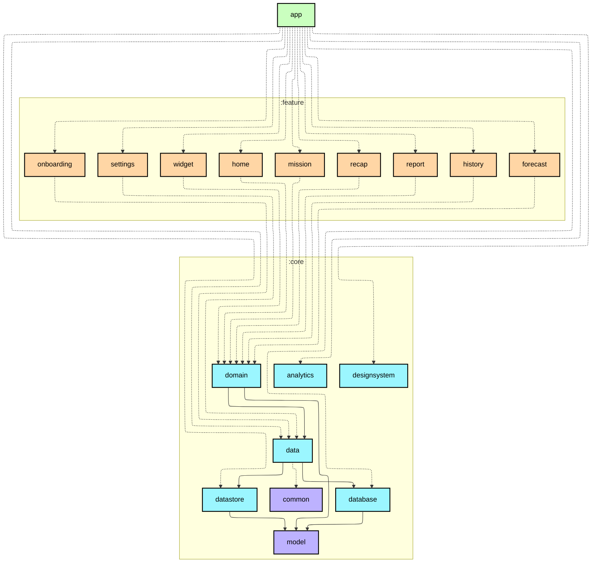
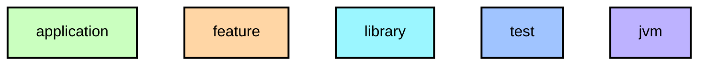

# `:app`

앱 진입점. `WalkLogApplication`(Hilt 루트), `MainActivity`(BottomNavigationView + XML NavGraph), 모든 기능 모듈의 DI 바인딩 조합.

## Module dependency graph

<!--region graph-->

📋 Graph legend

Arrow legend: `-->` = `api()` &nbsp;·&nbsp; `-.->` = `implementation()`
<!--endregion-->
