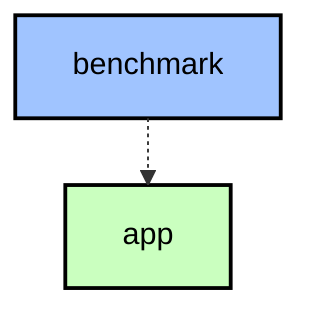
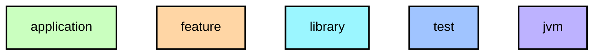

# `:benchmark`

Macrobenchmark 기반 Baseline Profile 생성. `:app`의 `benchmark` 빌드 타입을 타겟으로 콜드 스타트 시나리오를 측정합니다.

## Module dependency graph

<!--region graph-->

📋 Graph legend

Arrow legend: `-->` = `api()` &nbsp;·&nbsp; `-.->` = `implementation()`
<!--endregion-->
