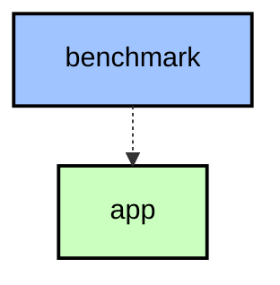
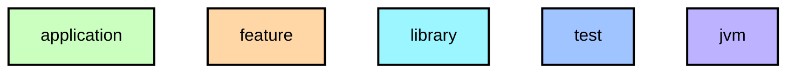

# `:benchmark`

Macrobenchmark 기반 성능 측정 모듈. `:app`의 benchmark 빌드 타입을 타겟으로 Baseline Profile 생성, 시작 시간 측정, 홈 스크롤 프레임 성능 측정을 담당합니다.

## 구성

```
benchmark/src/main/kotlin/com/river/walklog/benchmark/
├── BenchmarkMetrics.kt
├── GeneralActions.kt
├── Utils.kt
├── baselineprofile/
│   ├── StartupBaselineProfile.kt
│   └── HomeBaselineProfile.kt
├── home/
│   ├── HomeActions.kt
│   └── ScrollHomeFeedBenchmark.kt
└── startup/
    └── StartupBenchmark.kt
```

| 파일 | 역할 |
|---|---|
| `BenchmarkMetrics.kt` | `StartupTimingMetric` + `JIT Compiling %` + `L%/%;` (ClassInit) 묶음 |
| `GeneralActions.kt` | `startActivityAndAllowNotifications`, 온보딩·권한 처리 |
| `Utils.kt` | `PACKAGE_NAME`, `flingElementDownUp`, `waitAndFindObject`, `dumpWindowHierarchy` |
| `StartupBaselineProfile.kt` | 시작 경로만 수집 (`includeInStartupProfile = true`) |
| `HomeBaselineProfile.kt` | 홈 스크롤·주간 리포트·미션 상세 탐색 경로 수집 |
| `HomeActions.kt` | `homeScrollFeedDownUp`, `homeOpenWeeklyReportIfVisible`, `homeOpenMissionDetailIfVisible` |
| `ScrollHomeFeedBenchmark.kt` | None / Partial(Require) / Full — 10 이터레이션, WARM 스타트 |
| `StartupBenchmark.kt` | None / Partial(Disable) / Partial(Require) / Full — 20 이터레이션, COLD 스타트 |

## 실행

### Baseline Profile 생성

```bash
./gradlew :app:generateBaselineProfile
```

생성된 프로파일은 `app/src/main/baseline-prof.txt`에 자동 저장됩니다.

### 시작 시간 측정

```bash
./gradlew :benchmark:connectedBenchmarkAndroidTest \
  -Pandroid.testInstrumentationRunnerArguments.class=com.river.walklog.benchmark.startup.StartupBenchmark
```

| 테스트 메서드 | CompilationMode | 결과 지표 |
|---|---|---|
| `startupWithoutPreCompilation` | None | 기준선 (JIT only) |
| `startupWithPartialCompilationAndDisabledBaselineProfile` | Partial(Disable, warmup=1) | 프로파일 제외 부분 컴파일 |
| `startupPrecompiledWithBaselineProfile` | Partial(Require) | Baseline Profile 적용 |
| `startupFullyPrecompiled` | Full | AOT 전체 컴파일 |

### 홈 스크롤 프레임 성능 측정

```bash
./gradlew :benchmark:connectedBenchmarkAndroidTest \
  -Pandroid.testInstrumentationRunnerArguments.class=com.river.walklog.benchmark.home.ScrollHomeFeedBenchmark
```

| 테스트 메서드 | CompilationMode | 결과 지표 |
|---|---|---|
| `scrollFeedCompilationNone` | None | 기준선 프레임 타이밍 |
| `scrollFeedBaselineProfile` | Partial(Require) | Baseline Profile 적용 |
| `scrollFeedFullyPrecompiled` | Full | AOT 전체 컴파일 |

## Module dependency graph

<!--region graph-->

```mermaid
---
config:
  layout: elk
  elk:
    nodePlacementStrategy: SIMPLE
---
graph TB
  :benchmark[benchmark]:::android-test
  :app[app]:::android-application

  :benchmark -.-> :app

classDef android-application fill:#CAFFBF,stroke:#000,stroke-width:2px,color:#000;
classDef android-feature fill:#FFD6A5,stroke:#000,stroke-width:2px,color:#000;
classDef android-library fill:#9BF6FF,stroke:#000,stroke-width:2px,color:#000;
classDef android-test fill:#A0C4FF,stroke:#000,stroke-width:2px,color:#000;
classDef jvm-library fill:#BDB2FF,stroke:#000,stroke-width:2px,color:#000;
```

<details><summary>📋 Graph legend</summary>


```mermaid
graph TB
  application[application]:::android-application
  feature[feature]:::android-feature
  library[library]:::android-library
  test[test]:::android-test
  jvm[jvm]:::jvm-library

classDef android-application fill:#CAFFBF,stroke:#000,stroke-width:2px,color:#000;
classDef android-feature fill:#FFD6A5,stroke:#000,stroke-width:2px,color:#000;
classDef android-library fill:#9BF6FF,stroke:#000,stroke-width:2px,color:#000;
classDef android-test fill:#A0C4FF,stroke:#000,stroke-width:2px,color:#000;
classDef jvm-library fill:#BDB2FF,stroke:#000,stroke-width:2px,color:#000;
```

</details>

Arrow legend: `-->` = `api()` &nbsp;·&nbsp; `-.->` = `implementation()`
<!--endregion-->
