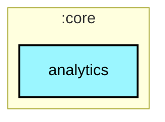
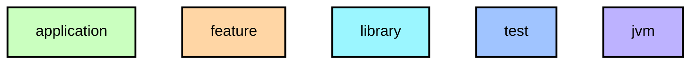

# `:core:analytics`

크래시 리포팅 인터페이스(`CrashReporter`)와 Firebase Crashlytics 구현체(`CrashlyticsReporter`). 기능 모듈이 Firebase에 직접 의존하지 않도록 추상화합니다.

## Module dependency graph

<!--region graph-->

📋 Graph legend

Arrow legend: `-->` = `api()` &nbsp;·&nbsp; `-.->` = `implementation()`
<!--endregion-->
