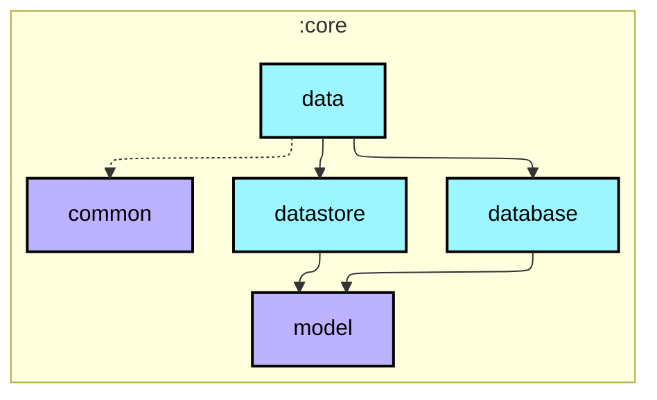
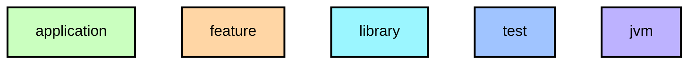

# `:core:data`

Repository 인터페이스(`StepRepository`, `UserSettingsRepository`)와 구현체. `core:database`와 `core:datastore`를 `api()`로 노출하여 소비자가 `core:model` 타입을 추가 선언 없이 사용할 수 있게 합니다.

## Module dependency graph

<!--region graph-->

📋 Graph legend

Arrow legend: `-->` = `api()` &nbsp;·&nbsp; `-.->` = `implementation()`
<!--endregion-->
