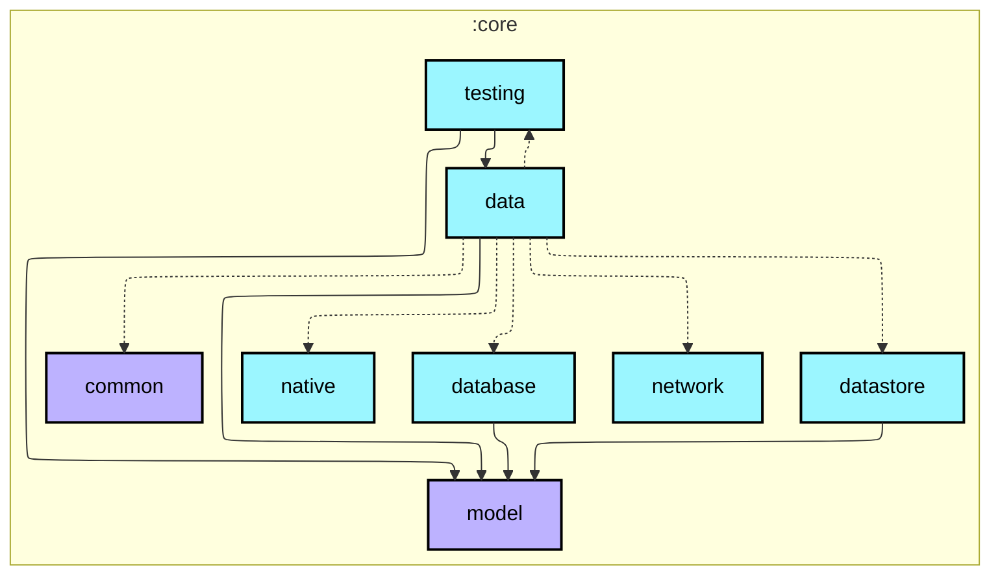
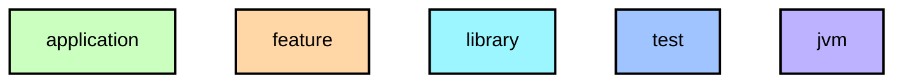

# `:core:data`

Repository 인터페이스와 구현체. `core:model`을 `api()`로 직접 노출하고, `core:database`·`core:datastore`·`core:network`·`core:native`는 `implementation()`으로 내부 구현을 캡슐화합니다.

## Module dependency graph

<!--region graph-->

```mermaid
---
config:
  layout: elk
  elk:
    nodePlacementStrategy: SIMPLE
---
graph TB
  subgraph :core
    direction TB
    :core:data[data]:::android-library
    :core:database[database]:::android-library
    :core:datastore[datastore]:::android-library
    :core:network[network]:::android-library
    :core:native[native]:::android-library
    :core:common[common]:::jvm-library
    :core:model[model]:::jvm-library
    :core:testing[testing]:::android-library
  end

  :core:data --> :core:model
  :core:data -.-> :core:database
  :core:data -.-> :core:datastore
  :core:data -.-> :core:network
  :core:data -.-> :core:native
  :core:data -.-> :core:common
  :core:data -.-> :core:testing
  :core:database --> :core:model
  :core:datastore --> :core:model
  :core:testing --> :core:data
  :core:testing --> :core:model

classDef android-application fill:#CAFFBF,stroke:#000,stroke-width:2px,color:#000;
classDef android-feature fill:#FFD6A5,stroke:#000,stroke-width:2px,color:#000;
classDef android-library fill:#9BF6FF,stroke:#000,stroke-width:2px,color:#000;
classDef android-test fill:#A0C4FF,stroke:#000,stroke-width:2px,color:#000;
classDef jvm-library fill:#BDB2FF,stroke:#000,stroke-width:2px,color:#000;
```

📋 Graph legend

```mermaid
graph TB
  application[application]:::android-application
  feature[feature]:::android-feature
  library[library]:::android-library
  test[test]:::android-test
  jvm[jvm]:::jvm-library

classDef android-application fill:#CAFFBF,stroke:#000,stroke-width:2px,color:#000;
classDef android-feature fill:#FFD6A5,stroke:#000,stroke-width:2px,color:#000;
classDef android-library fill:#9BF6FF,stroke:#000,stroke-width:2px,color:#000;
classDef android-test fill:#A0C4FF,stroke:#000,stroke-width:2px,color:#000;
classDef jvm-library fill:#BDB2FF,stroke:#000,stroke-width:2px,color:#000;
```

Arrow legend: `-->` = `api()` &nbsp;·&nbsp; `-.->` = `implementation()` / `testImplementation()`
<!--endregion-->
