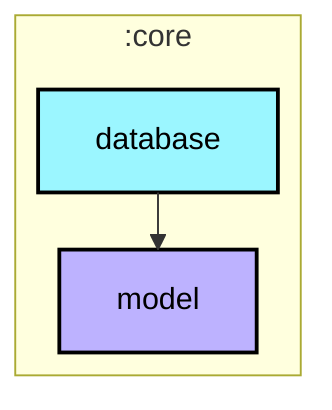
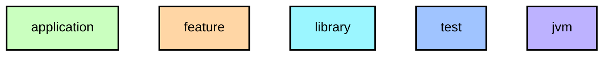

# `:core:database`

Room 데이터베이스, DAO, Entity 정의. `core:model` 타입을 `api()`로 노출하여 상위 레이어가 별도 의존 선언 없이 사용할 수 있게 합니다.

## Module dependency graph

<!--region graph-->

📋 Graph legend

Arrow legend: `-->` = `api()` &nbsp;·&nbsp; `-.->` = `implementation()`
<!--endregion-->
