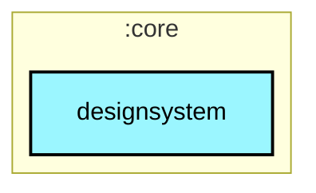
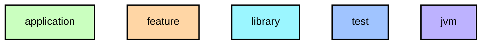

# `:core:designsystem`

앱 전반에서 공유하는 Compose UI 컴포넌트, 색상, 타이포그래피, Coil 이미지 로딩 헬퍼.

## Module dependency graph

<!--region graph-->

📋 Graph legend

Arrow legend: `-->` = `api()` &nbsp;·&nbsp; `-.->` = `implementation()`
<!--endregion-->
