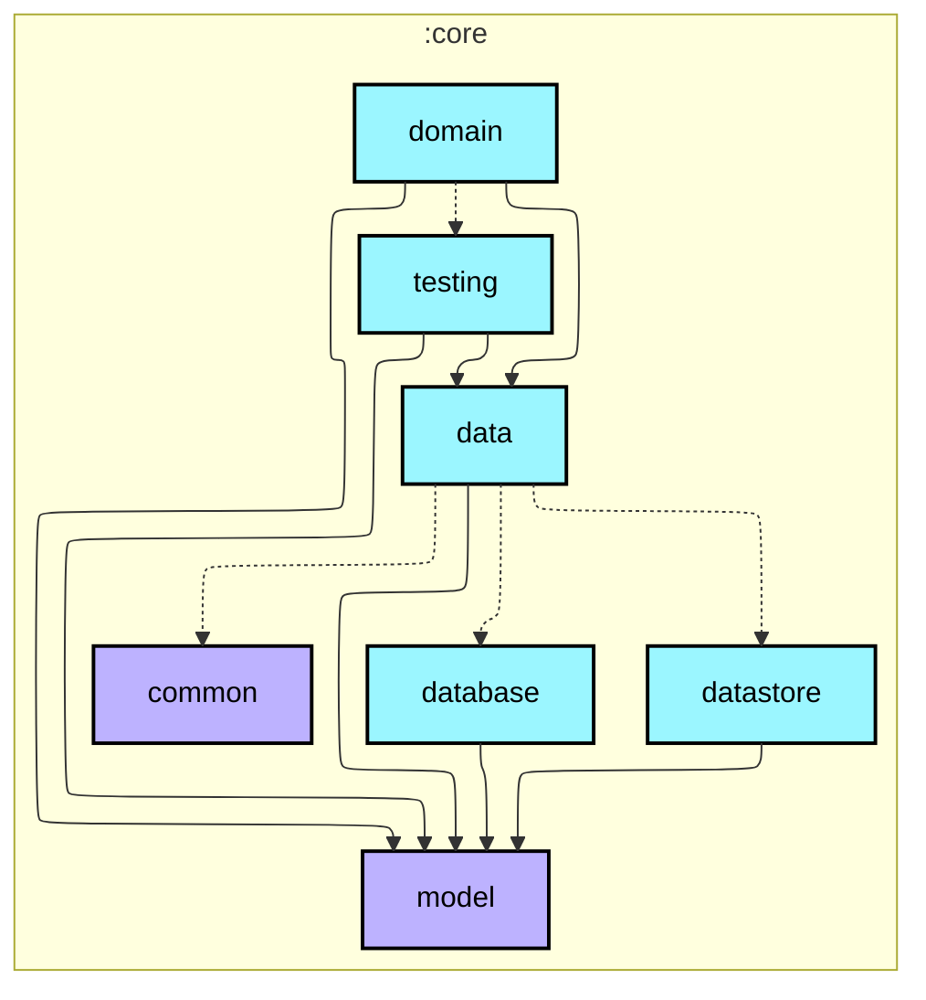
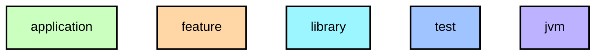

# `:core:domain`

비즈니스 로직을 캡슐화하는 Use Case 모음. Use Case는 `core:data`의 Repository 계약과 `core:model`만 참조하고, native/LiteRT/JNI 구현 세부사항은 알지 않습니다.

## Module dependency graph

<!--region graph-->

📋 Graph legend

Arrow legend: `-->` = `api()` &nbsp;·&nbsp; `-.->` = `implementation()` / `testImplementation()`
<!--endregion-->
