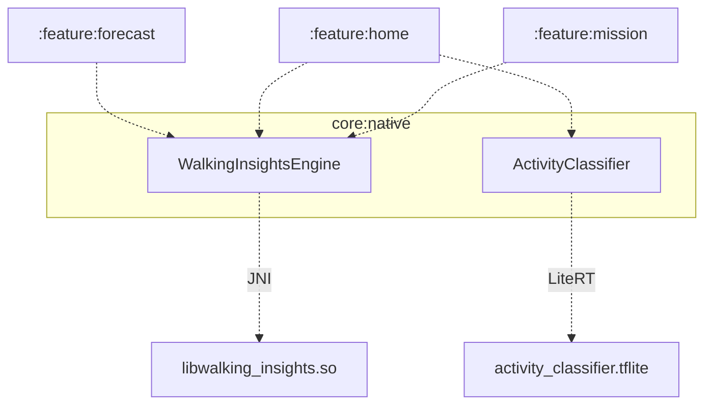

# core:native

온디바이스 분석 엔진 모듈. JNI/NDK 기반 C++ Walking Insights 엔진과 LiteRT 기반 Activity Classifier를 제공합니다.

## Module Graph



실선 `-->` = `api()`, 점선 `-.->` = `implementation()`

## 구성 요소

| 파일 | 역할 |
|---|---|
| `WalkingInsightsEngine.kt` | JNI 브리지 — C++ 엔진 호출, 입력 검증, 결과 역직렬화 |
| `ActivityClassifier.kt` | LiteRT Interpreter 래핑 — 센서 윈도우 → 활동 상태 분류 |
| `WalkingInsightsResult.kt` | 엔진 결과 데이터 클래스 |
| `ActivityState.kt` | 활동 상태 열거형 (WALKING / STATIONARY / UNKNOWN) |
| `di/NativeEngineModule.kt` | Hilt `@Singleton` 바인딩 |
| `cpp/walking_insights_engine.h/cpp` | 네이티브 분석 알고리즘 |
| `cpp/walking_insights_jni.cpp` | JNI 진입점 |

## C++ 엔진 — libwalking_insights.so

입력: `float[days × 24]` — 최대 7일치 시간대별 걸음 수

| 출력 신호 | 알고리즘 | 범위 |
|---|---|---|
| `peakHour` | 지수 가중 시간대 누적 → argmax | 0–23 |
| `weeklyTrend` | 최근 절반 / 이전 절반 평균 비율 → sigmoid 정규화 | 0.0–1.0 |
| `recoveryDifficulty` | 7일 목표 달성률 평균 | 0.2–0.8 |
| `streakRisk` | 페이스 비율 × 예상 완료율 결핍 | 0.0–1.0 |

## LiteRT 모델 — ActivityClassifier

```
입력  [1, 50, 6]  — 50 Hz × 1초 윈도우, 채널: accel x/y/z + gyro x/y/z
출력  [1, 3]      — WALKING / STATIONARY / UNKNOWN softmax 확률
```

모델 파일(`activity_classifier.tflite`)은 빌드에 포함되지 않습니다.
배치 전 `src/main/assets/MODEL_README.md`의 변환 절차를 따르세요.

## JNI 데이터 흐름

```
Kotlin: FloatArray(days × 24)
    ↓ JNI_ABORT (read-only)
C++:  const float* hourly_steps
    ↓ analyze()
C++:  WalkingInsights { peak_hour, weekly_trend, recovery_difficulty, streak_risk }
    ↓ SetFloatArrayRegion
Kotlin: FloatArray(4) → WalkingInsightsResult
```
