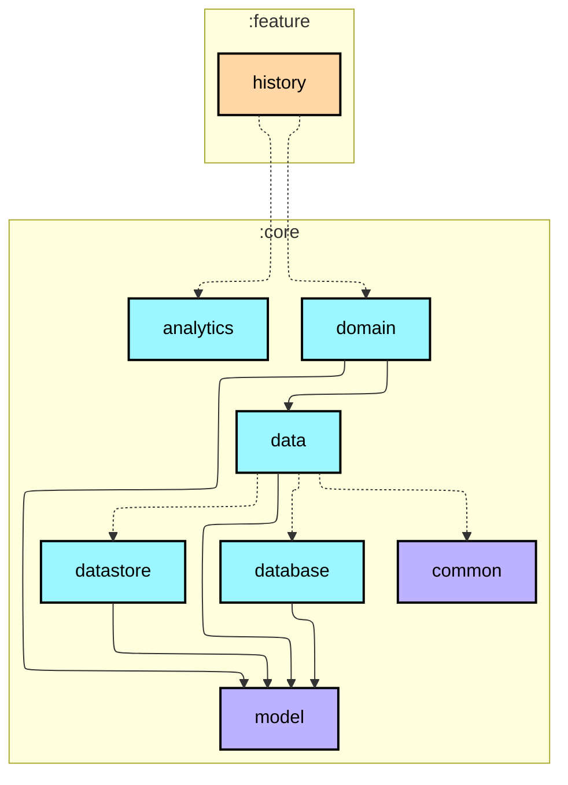
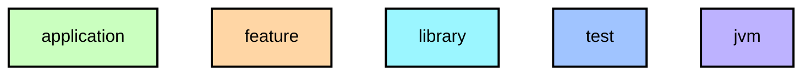

# `:feature:history`

월간 걸음 기록 달력 화면. XML Fragment + RecyclerView 기반 (하이브리드 구조 의도적 선택).

- `GridLayoutManager(7)` 7열 달력 그리드 — 요일 헤더 · 빈 셀 · 날짜 셀 3가지 ViewType
- 날짜 셀: 달성일(초록 원) · 오늘(테두리 원) · 부분 달성(회색 원) · 미기록(투명) 시각 구분
- `YearMonth` API 월 단위 탐색 (현재 달 이후 이동 불가)
- 하단 통계 바: 이달 총 걸음 수 · 목표 달성률
- 실 데이터만 표시 — 기록 없는 날은 미기록(투명) 셀로 렌더링

## Module dependency graph

<!--region graph-->

📋 Graph legend

Arrow legend: `-->` = `api()` &nbsp;·&nbsp; `-.->` = `implementation()`
<!--endregion-->
