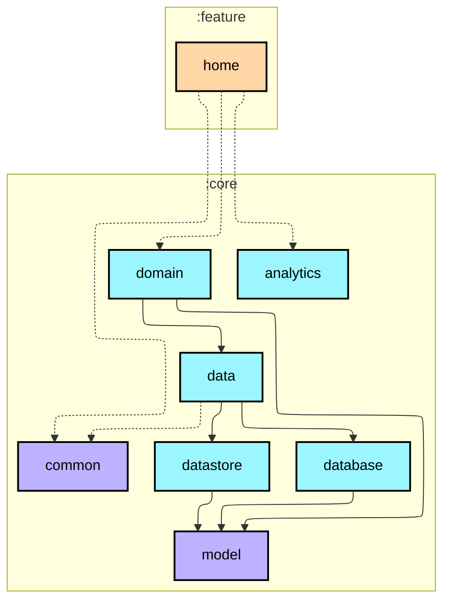
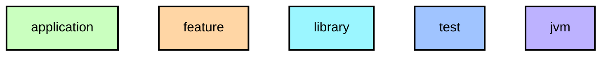

# `:feature:home`

홈 화면. 실시간 걸음 수, 주간 요약 카드, 월간 리캡 카드, 걷기 예보 배너.

- `StepRepository`를 직접 주입하고 비즈니스 로직이 필요한 Use Case(`GetWeeklyStepSummaryUseCase`, `GetMonthlyRecapUseCase`)는 `core:domain`을 통해 사용
- `WalkProgressRing` — `ActivityState.WALKING` 상태일 때 링 트랙 pulse 애니메이션 (0.9초 주기로 명도 맥동)
- **걷기 예보 peakHour 보정** — 7일 중 3일 이상 실데이터가 존재하고 peakHour가 오전 6시~오후 10시 범위일 때만 표시 (데이터 희박 시 잘못된 새벽 시간대 노출 방지)
- **정지 알림** (`UserSettingsRepository.notificationsEnabled` 체크):
  - STATIONARY 상태 1시간 지속 → "지금 걸어볼까요?" 알림 발송
  - 발송 가능 시간대: 오전 9시 ~ 오후 9시
  - 발송 후 2시간 cooldown, 하루 최대 3회
  - WALKING 전환 시 타이머 즉시 초기화

## Module dependency graph

<!--region graph-->

📋 Graph legend

Arrow legend: `-->` = `api()` &nbsp;·&nbsp; `-.->` = `implementation()`
<!--endregion-->
