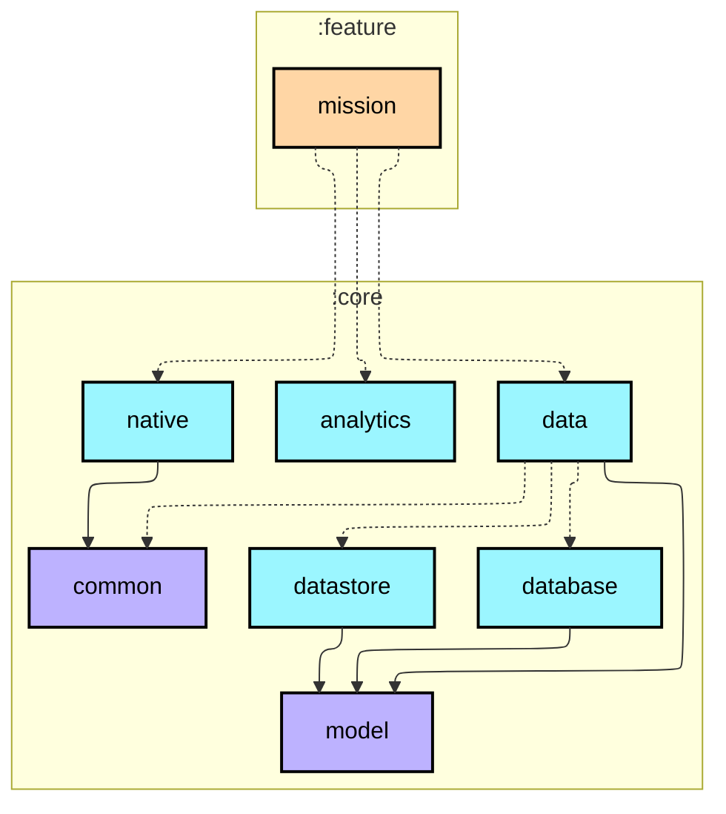
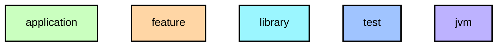

# `:feature:mission`

미션 상세 화면. 오늘 미션 / 회복 미션 / 달성 완료 상태를 단일 화면에서 분기 처리.

- `MissionTypeBadge` — 오늘 미션 / 회복 미션 / 달성 완료 배지 (배경색 + 텍스트 분기)
- `MissionHeadlineSection` — 미션 타입별 대제목 · 부제목
- `MissionProgressCard` — 현재/목표 걸음 수 · 남은 걸음 수 · 보상 텍스트 · `WalkLogLinearProgressBar`
- `MissionGuideCard` — peakHour 기반 추천 시간대 포함, 미션 타입별 안내 문구 3종
- Bottom CTA: "지금 걸으러 가기" / "이미 달성했어요" — 달성 시 버튼 비활성화 + 색상 전환

## Module dependency graph

<!--region graph-->

📋 Graph legend

Arrow legend: `-->` = `api()` &nbsp;·&nbsp; `-.->` = `implementation()`
<!--endregion-->
