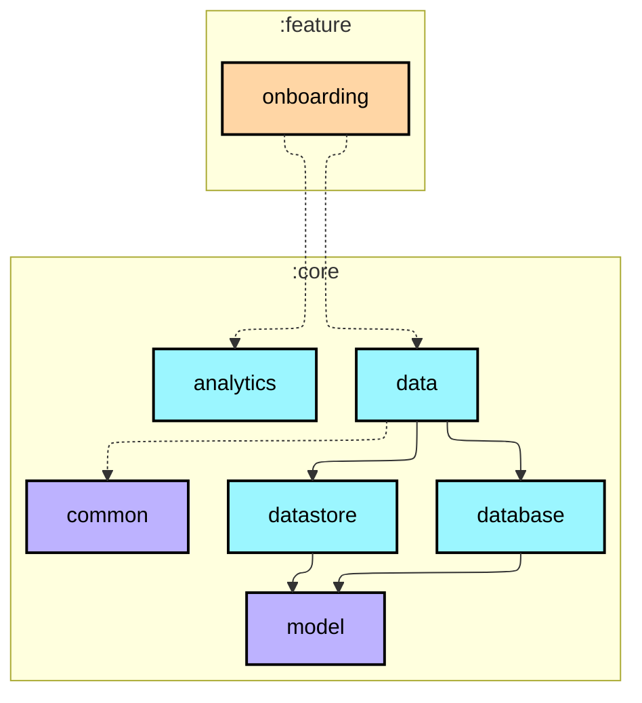
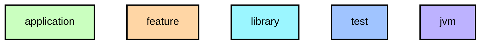

# `:feature:onboarding`

3단계 온보딩 플로우. 권한 요청, 목표 걸음 수 설정, 알림 설정. Use Case 없이 `StepRepository` / `UserSettingsRepository`를 직접 사용하므로 `core:domain`이 아닌 `core:data`에 의존합니다.

## Module dependency graph

<!--region graph-->

📋 Graph legend

Arrow legend: `-->` = `api()` &nbsp;·&nbsp; `-.->` = `implementation()`
<!--endregion-->
