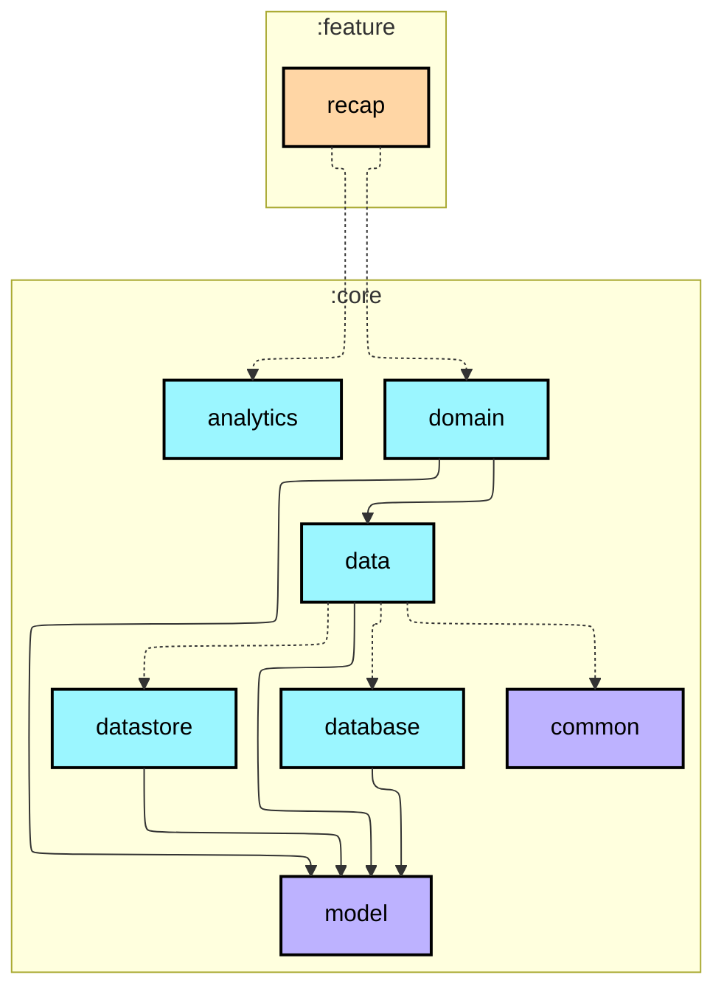
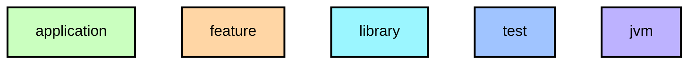

# `:feature:recap`

월간 리캡 화면. 총 걸음 수, 활동일, 평균, 최고 기록, 연속 달성 스트릭, 예상 칼로리.

## Module dependency graph

<!--region graph-->

📋 Graph legend

Arrow legend: `-->` = `api()` &nbsp;·&nbsp; `-.->` = `implementation()`
<!--endregion-->
