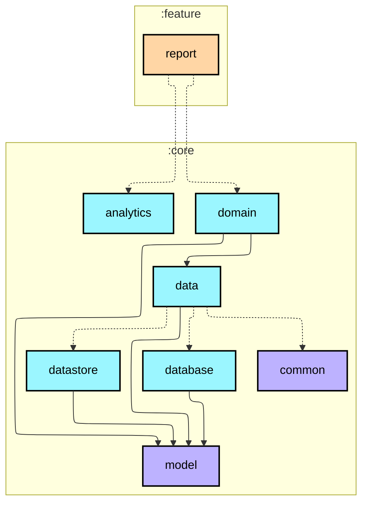
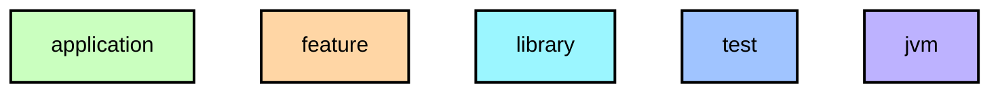

# `:feature:report`

주간 리포트 화면. 카드 기반 대시보드 UI로 구성되며 3개의 카드 섹션을 제공합니다.

- **요일별 막대 그래프 카드** — 월~일 7개 막대, 최다 걸음 요일 하이라이트
- **총 걸음 수 카드** — 주간 합계 + 아이콘
- **목표 달성 카드** — `achievedDays / 7` + `WalkLogLinearProgressBar`
- 공유 카드 미리보기 접기/펼치기 토글 ("보기" / "접기") — 하단 고정 공유 버튼
- 실 데이터 없을 때 빈 상태(Empty) UI 표시 — 더미 데이터 제거
- 빈 상태·에러 상태에서 공유 버튼 자동 숨김
- 다크 테마 완전 대응 (`WalkLogTheme.colors.*` 토큰 참조)
- Compose `GraphicsLayer` → Bitmap → `FileProvider` URI 이미지 공유

## Module dependency graph

<!--region graph-->

📋 Graph legend

Arrow legend: `-->` = `api()` &nbsp;·&nbsp; `-.->` = `implementation()`
<!--endregion-->
