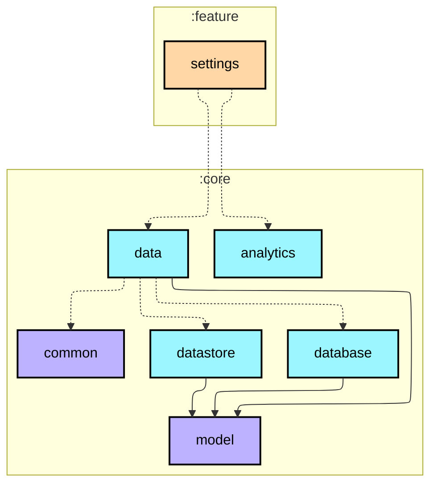
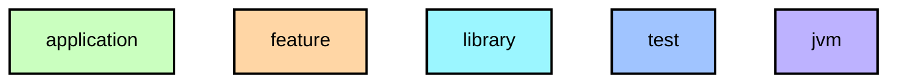

# `:feature:settings`

설정 화면. XML Fragment + ViewBinding 구현. `UserSettingsRepository`를 직접 주입하므로 `core:domain`이 아닌 `core:data`에 의존합니다.

- 일일 걸음 목표 변경 (SeekBar, 5,000~20,000보, 500보 단위)
- 회복 미션 걸음 수 조정 (SeekBar, 3,000보~)
- 알림 On/Off 토글
- 라이트 / 다크 / 시스템 테마 선택 → `AppCompatDelegate.setDefaultNightMode()` 즉시 적용
- `DataStore`에 실시간 저장, 앱 재시작 없이 영구 유지

## Module dependency graph

<!--region graph-->

📋 Graph legend

Arrow legend: `-->` = `api()` &nbsp;·&nbsp; `-.->` = `implementation()`
<!--endregion-->
